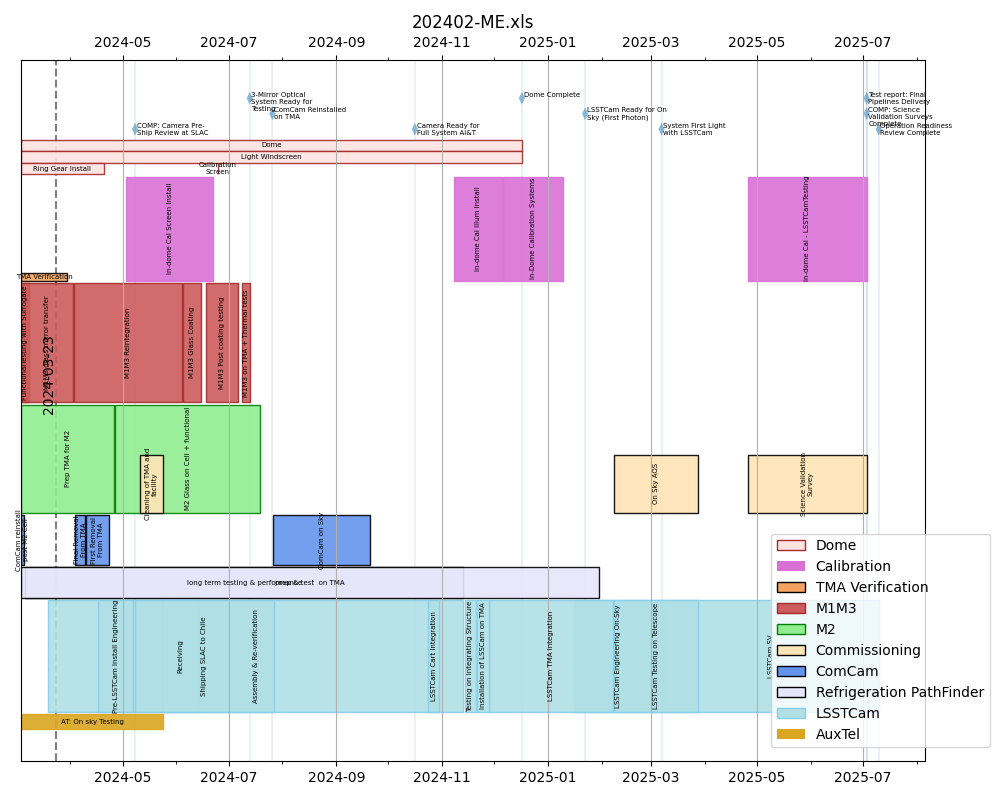

.. Auto-generated by milestones/milestones.py on Tue Apr  4 20:42:14 2023 - DO NOT EDIT

:tocdepth:

Provenance
==========

This document was generated based on the contents of the `lsst-dm/milestones <https://github.com/lsst-dm/milestones>`_ repository, version `f17c671b <https://github.com/lsst-dm/milestones/commit/f17c671b7fd929f89fc85982f7ac512355095631>`_, dated 2023-04-05.
This corresponds to the status recorded in the project controls system for March 2023.

Top milestones
==============

- **2022-09-30** : EPO Construction Finish (EPOC285)  **Completed 2022-09-30**

- **2023-02-28** : TMA Handoff to Rubin (T&SC-0400-1730) 

- **2023-06-21** : COMP: Camera Pre-Ship Review at SLAC (CAMM8090) 

- **2024-04-04** : Camera Ready for Full System AI&T (COMC-060200-20930) 

- **2024-04-18** : Dome Complete (T&SC-0400-0950) 

- **2024-05-20** : 3-Mirror Optical System Ready for Testing (T&SC-1100-0400) 

- **2024-06-28** : LSSTCam Ready for On Sky (First Photon) (SITCOM-122) 

- **2024-10-08** : System First Light (LSST-1520) 

- **2025-02-03** : Test report: Final Pipelines Delivery (LDM-503-17a) 

- **2025-02-03** : COMP: Science Validation Surveys Complete (COMC-0654-0430) 

- **2025-02-10** : Operation Readiness Review Complete (SITCOM-130) 

A public HTML version for embedding is `here <./top_milestones.html>`_.

Supporting milestones
=====================

- **2020-12-31** : ComCam Ops Readiness (LDM-503-11a)  **Completed 2020-12-31**

- **2022-09-30** : User Interfaces Complete (EPO-M6)  **Completed 2022-09-30**

- **2022-09-30** : Citizen Science Commissioning Project running via LSST infrastructure Complete (EPOC304)  **Completed 2022-09-30**

- **2023-02-10** : COMP:  Camera Ready for Verification Testing (ITC00475_COM) 

- **2023-03-28** : Camera support asmy w/ComCam+PF+Int#1+CCW Installed on Telescope (SITCOM-92) 

- **2023-05-18** : COMP: TMA Refrigeration Tests Complete (SUMMIT-3023) 

- **2023-05-31** : OCS Available on Summit (DM-35987) 

- **2023-05-31** : TCS Demonstrated (DM-35989) 

- **2023-05-31** : TMA safe for transition to M1M3 glass mirror (SITCOM-102) 

- **2023-06-12** : M2 Software demonstrated (DM-35988) 

- **2023-07-20** : M1M3 cell+Surrogate Dynamic Testing on TMA done (SITCOM-97) 

- **2023-09-11** : ComCam + PF re-Installed on TMA (SITCOM-105) 

- **2023-09-28** : Love Contract Complete (LSST4820) 

- **2023-10-06** : LSSTCam Received @ Summit (SUMMIT-2976) 

- **2023-12-06** : Completion of the Scheduler (DM-27734) 

- **2024-03-18** : M2 coating decision (SITCOM-127) 

- **2024-03-18** : M2 Glass installed on Cell (SITCOM-104) 

- **2024-04-02** : M2 Installed on Telescope (T&SC-1100-0300) 

- **2024-04-04** : Ops rehearsal for data release processing #1 (LDM-503-13) 

- **2024-04-04** : LSSTCam reverification complete (SITCOM-125) 

- **2024-05-02** : LSSTCam Installed on TMA (SITCOM-123) 

- **2024-05-20** : M1M3 installed on the TMA (SITCOM-110) 

- **2024-06-21** : LSSTCam Cold (New1135) 

- **2024-07-16** : Full focal plane readout complete (New1110) 

- **2024-08-06** : Telescope Aligned (New1165) 

- **2024-10-08** : Ops rehearsal for data release processing #3 (LDM-503-16) 

- **2024-10-08** : Solar System Processing pipeline available. (DM-AP-17) 

- **2024-10-08** : Initial Optical testing on TMA complete (SITCOM-116) 

- **2024-11-13** : Start SV Data Collection (COMC-0140) 

- **2025-02-03** : Full integration of the Alert Production system within the operational environment. (DM-AP-16) 

`Download the PDF of this Block Schedule here. <./blockschedule.pdf>`_

`Download PDF of Block Schedule with fixed dates here. <./blockschedule-fixdate.pdf>`_

.. include:: acronyms.rst
