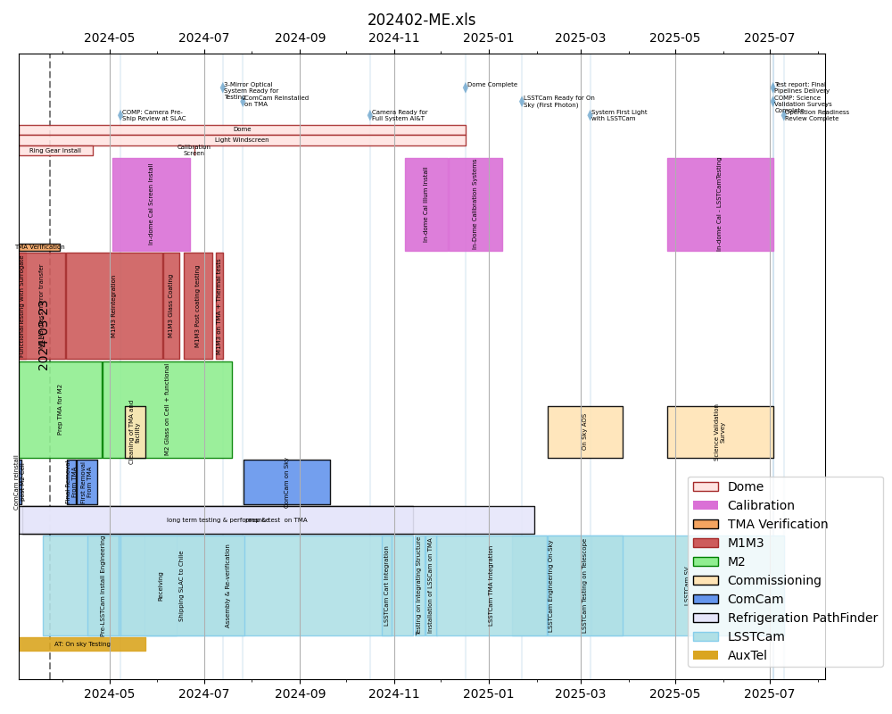

.. Auto-generated by milestones/milestones.py on Tue Mar 26 11:42:33 2024 - DO NOT EDIT

######################
Celebratory Milestones
######################

Provenance
==========

This document was generated based on the contents of the `lsst-dm/milestones <https://github.com/lsst-dm/milestones>`_ repository, version `cd818df9 <https://github.com/lsst-dm/milestones/commit/cd818df949b6250390607f3888a3f7e37ac488b8>`_, dated 2024-03-26.
This corresponds to the status recorded in the project controls system for March 2024.  This compares to February 2024.

Key milestones
==============

.. list-table::
   :header-rows: 1

   * - Code
     - Name
     - Due
     - Previously
   * - A1570
     - Dome Structure enclosed
     - 2022-11-30
     - **Completed**
   * - T&SC-5600-9380
     - Demonstration of CCW control using CSC  (Tekniker) - Complete
     - 2023-02-01
     - **Completed**
   * - T&SC-5600-9499
     - Begin TMA Vendor final performance Testing
     - 2023-03-20
     - **Completed**
   * - T&SC-5600-9445
     - Start TMA Science verification (Tekniker/UTE)
     - 2023-03-27
     - **Completed**
   * - T&SC-5500-1200
     - Beneficial Occupancy of Telescope Mount
     - 2023-04-28
     - **Completed**
   * - T&SC-6800-1463
     - Atmospheric Telescope Ready at Summit
     - 2023-05-31
     - **Completed**
   * - T&SC-6800-4190
     - AuxTel Vent Gates upgrade complete
     - 2023-05-31
     - **Completed**
   * - T&SC-5600-9090
     - MCS & IS integration and verification - Complete
     - 2023-05-31
     - **Completed**
   * - SUMMIT-3013
     - NEED: Pathfinder in ComCam on TMA
     - 2023-06-30
     - **Completed**
   * - A9290
     - Provisional dome rotation deCommissioning
     - 2024-01-19
     - **Completed**
   * - T&SC-5400-6300
     - Dome Ready For TMA Science Verification
     - 2024-02-01
     - **Completed**
   * - A9300a
     - Installation of Az Pinion & Gear completed
     - 2024-03-01
     - 2024-03-01
   * - SITCOM-105
     - ComCam + PF re-Installed on TMA
     - 2024-03-04
     - 2024-03-04
   * - SUMMIT-2975
     - LSSTCam Pre-Ship Acceptance
     - 2024-05-07
     - 2024-05-07
   * - SUMMIT-2976
     - LSSTCam Received @ Summit
     - 2024-05-22
     - 2024-05-22
   * - A9370
     - Calibration Screen Installation complete
     - 2024-06-24
     - 2024-06-24
   * - A9360
     - Light Baffle installation Complete
     - 2024-07-08
     - 2024-07-08
   * - SUMMIT-3056
     - COMP: Camera Reverification Complete
     - 2024-10-02
     - 2024-10-15
   * - SITCOM-125
     - LSSTCam reverification complete
     - 2024-10-02
     - 2024-10-15
   * - SITCOM-123
     - LSSTCam Installed on TMA
     - 2024-11-14
     - 2024-11-27
   * - A9410
     - Installation of  Light Windscreen Complete
     - 2024-12-16
     - 2024-12-16
   * - SITCOM-XXX
     - Camera Ready for Engineering Punchlist Resolution
     - 2025-01-01
     - 2025-01-14
   * - New1135
     - LSSTCam Cold
     - 2025-01-01
     - 2025-01-14
   * - New1110
     - Full focal plane readout complete
     - 2025-01-24
     - 2025-02-06
   * - SUMMIT-3023
     - COMP: TMA Refrigeration Tests Complete
     - 2025-01-29
     - 2025-01-29
   * - COMC-0654-1000
     - COMP: Calibration Products Production Verified
     - 2025-06-19
     - 2025-07-02

A public HTML version for embedding is `here <./top_milestones.html>`_.

`Download the PDF of this Block Schedule here. <./blockschedule.pdf>`_

.. include:: acronyms.rst
